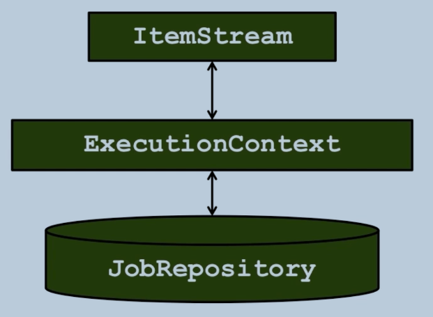
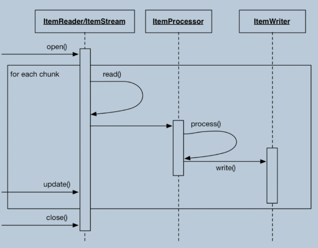

# spring-batch-developer-course
Sources written during the ultimate spring batch developer course on Udemy.

## Getting started

### hello-world
Smallest possible demo including spring batch database repository.

### transitions
Demonstrates transitions between steps.

### flow
Simple job flow demo. Uses one flow in two different jobs.

### split
Demonstrates splitted step execution for parallel execution.

### decisions
Demonstrates conditional flow based on state of job execution.

### nested jobs
Demonstrates nested job configuration and start definition by application.properties.

### listeners

types:
- JobExecutionListener
- StepExecutionListener
- CHunkListener
- ItemReadListener
- ItemProcessListener
- ItemWriteListener

Example shows use of batch listeners with:
- ChunkListener
- JobExecutionListener
    - sends mail before and after job starts
    - mail sending needs appropriate settings in application.properties
- configuration
    - item reader: uses ListItemReader

### job parameters

Uses parameter in demo to be printed out in tasklet by injection.

```java
    @Bean
    @StepScope
    Tasklet helloWorldTasklet(@Value("#{jobParameters['message']}") String message) {
        return ((stepContribution, chunkContext) ->  {
            System.out.println(message);
            return RepeatStatus.FINISHED;
        });
    }

    @Bean
    Step step() {
        return stepBuilderFactory.get("step")
                .tasklet(helloWorldTasklet(null))
                .build();
    }
```
*Notice* helloWorldTasklet is defined in the step configuration to be called with null. Actually this will be replaced by the value of the parameter by Spring. Spring uses it only as a reference to the bean generated just above.

`@StepScope` means beans are lazily instantiated when the step using them is executed.

run with: `java -jar target\job-parameters-0.0.1-SNAPSHOT.jar message=hello`

first version can be executed multiple times. 2nd version is with spring batch database - repeated runs using same message will fail.  
`Caused by: org.springframework.batch.core.repository.JobInstanceAlreadyCompleteException: A job instance already exists and is complete for parameters={message=hello}.  If you want to run this job again, change the parameters.`

## Input & Output data

ItemReader and ItemWriter  
Item = Record

### input interfaces

Demonstrates a simple item reader reading a list of strings.  
*notice*`.<String, String>chunk(2)` in the step config parametrises the types provided by the reader and consumed by the writer.

### database input

Use of database to read from. Example shows customer records readin in.
1. Cursor Item Reader
    - !demo implementation not thread save!
2. Paging Item Reader
    - fetchsize = chunk size
    - paging requires key to determine current page position &rarr; unique sort field required

### flat files

Demo of CSV reading.   
uses `DelimitedLineTokenizer`

### reading XML
Demo of reading xml data.
```xml
<customers>
	<customer>
		<id>1</id>
		<firstName>Mufutau</firstName>
		<lastName>Maddox</lastName>
		<birthdate>2016-06-05 19:43:51PM</birthdate>
	</customer>
	<customer>
		<id>2</id>
		<firstName>Brenden</firstName>
		<lastName>Cobb</lastName>
		<birthdate>2016-01-06 13:18:17PM</birthdate>
	</customer>
...
</customers>
```
one record is:
```xml
	<customer>
		<id>1</id>
		<firstName>Mufutau</firstName>
		<lastName>Maddox</lastName>
		<birthdate>2016-06-05 19:43:51PM</birthdate>
	</customer>
```

### multiple flat files
Reads multiple CSV files.
```java
    @Value("classpath*:/data/customer*.csv")
    private Resource[] inputFiles;

    ...

    @Bean
    MultiResourceItemReader<Customer> multiResourceItemReader() {
        ...
        itemReader.setResources(inputFiles);

        return itemReader;
    }

```
ResourceAware will handle storing resource information in generated objects.
```java
public class Customer implements ResourceAware {
    ...
    private Resource resource;

    ...
    @Override
    public void setResource(Resource resource) {
        this.resource = resource;
    }

```
### item stream
Demonstrates stateful job processing.
  



*notice* needs to be run twice to fully do the job.

### item writer
Demo writes to console output.

### database output
Writing into a database.

### flat file output
Demonstrates writing of a file.
2nd version uses JSON format.

### xml output
Shows writing of a xml file.

### write multiple destinations
How to write to multiple destinations. Reads from DB. Writes one XML and one JSON file.
First version uses CompositeItemWriter.
Second version writes the odd items to the JSON file and the even numbers to XML file.
```java
    ...
    .stream(xmlItemWriter()) // inform spring batch the underlying writers used by the 
    .stream(jsonItemWriter()) // ClassifierCompositeItemWriter are stateful
    ...
```
## Processing Models 
### item processor interface